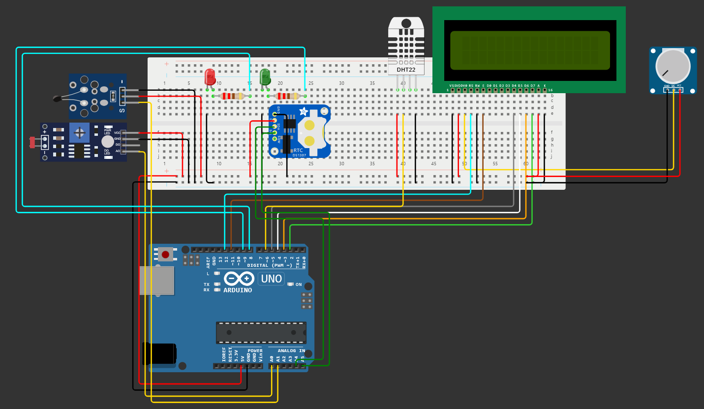

# Sensor Inteligente para Pistas de Corrida

## Descrição

Este projeto consiste em um sensor inteligente desenvolvido para monitorar condições ambientais e de pista em circuitos de corrida. Utilizando sensores de temperatura, umidade, luminosidade e termistores, o sistema é capaz de fornecer informações precisas e em tempo real, ajudando a manter a segurança e o desempenho ideal durante as corridas. Todas essas informações seriam passadas para o nosso site e mostrados para os nossos clientes.

## Funcionalidades

- **Monitoramento de Temperatura:** Mede a temperatura ambiente e da pista.
- **Monitoramento de Umidade:** Mede a umidade do ar.
- **Monitoramento de Luminosidade:** Detecta níveis de luz na pista.
- **Display LCD:** Exibe informações em tempo real.
- **Registro de Dados:** Armazena dados na EEPROM para análise posterior.
- **Alarmes Visuais:** LEDs indicam condições fora dos parâmetros ideais.

## Observações

- O sensor de luminosidade pode precisar de ajustes nos coeficientes para corresponder ao seu LDR específico.
- A precisão dos sensores pode variar conforme as condições ambientais e a calibração.

## Acesso ao Projeto

- [Projeto no Wokwi](https://wokwi.com/projects/400265612576825345)

## Acesso ao Vídeo

- [Demonstração em Vídeo](https://youtube.com/seu-video)

## Componentes

- 1x Sensor DHT22 (Temperatura e Umidade)
- 1x LDR (Sensor de Luminosidade)
- 1x Termistor (Sensor de Temperatura da Pista)
- 1x Display LCD 16x2
- 2x LEDs (Vermelho e Verde)
- 1x Módulo RTC DS1307 (Relógio de Tempo Real)
- Resistores, fios e outros componentes eletrônicos necessários

## Instruções de Uso

1. **Montagem do Hardware:** Conecte todos os sensores e componentes conforme o esquema elétrico.
2. **Upload do Código:** Carregue o código `SensorInteligente.ino` para a placa Arduino.
3. **Inicialização:** Após a carga do código, o sistema iniciará a leitura dos sensores e exibirá os dados no LCD.
4. **Monitoramento:** Observe os LEDs e o display LCD para monitorar as condições da pista.
5. **Análise de Dados:** Utilize os dados armazenados na EEPROM para análise posterior.

## Requisitos

- Placa Arduino UNO R3
- IDE Arduino instalada
- Cabos e conexões apropriadas

## Dependências

- Biblioteca DHT: [DHT Sensor Library](https://github.com/adafruit/DHT-sensor-library)
- Biblioteca LiquidCrystal: Incluída na IDE Arduino
- Biblioteca EEPROM: Incluída na IDE Arduino
- Biblioteca RTClib: [RTClib](https://github.com/adafruit/RTClib)

## Colaboradores

- [João Victor Soave](https://github.com/jaoAprendiz)
- [Felipe Nascimento](https://github.com/felipe3103)
- [Henrique Ignacio](https://github.com/henriqueignacio)
- [Gustavo Martins](https://github.com/gustavo190805)

## Tecnologias Utilizadas

